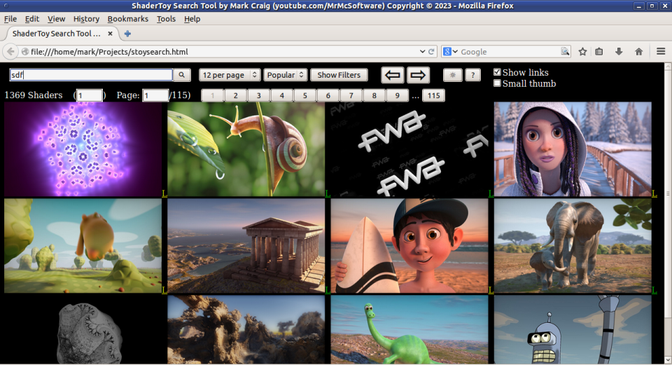
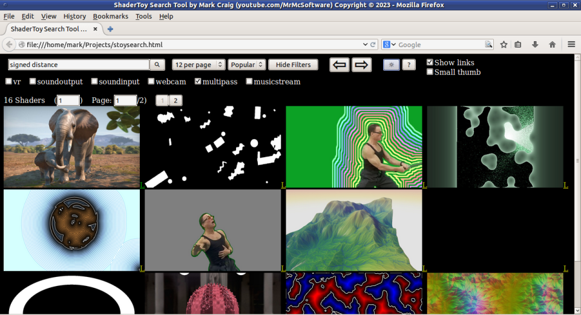
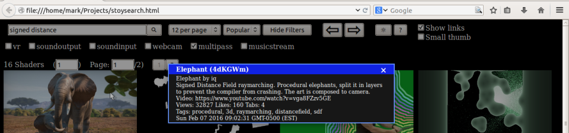

Shadertoy Search Tool
=====================

This is an HTML file for searching shadertoy for shaders and playing them.
It will only find shaders with the "**Public + API**" privacy setting (Refer
to the [Limitations](#limitations) section).

 
 

(I purposely used an older browser for the screenshots because I prefer the 3d
look over the flat button look of some modern browsers.)

## Setup and Running

>**OPTIONAL:**  If you want a gradual transition between Dark and Light modes,
>uncomment the line containing **transition: color 300ms, background-color 300ms;**

There are various ways of starting up this webpage.  If your browser is in your
search path you could simply do the following, for example, at a command prompt:

    firefox stoysearch.html

Or you could start your browser and use your browser's "Open File" (or
equivalent) menu option.  Or you could use the **`file:///`** URI/protocol and
specify the whole path.

## User Interface

While using this tool, you can press the **?** (Help) button to get the
following information.

### Mouse Button Actions

Click **left mouse button** on a shader thumbnail to run the shader in place.
Tip: when you do this, move the pointer out of the thumbnail area to allow the
control panel to go away.  If you desire the control panel to always be shown,
hold down the **Ctrl** key on keyboard while doing the above mouse click.  If
you want any possible sound muted, hold down both **Ctrl** and **Shift** while
doing the above mouse click.  If you want to see a larger version of the
thumbnail (and not run the shader), hold down the **Shift** key while doing the
above mouse click.  Note: once you run a shader, these options are no longer
available for that shader unless you reload the page via either the
"**Reload page**" option of the "**Results Per Page**" button or any other
feature that refreshes the page.  Larger versions are also shown if
"**1 per page**" is selected with the **Results Per Page** button.  Note:
thumbnails may all be different sizes, due to the fact that the thumbnail is
created at the point of their shader's run (and characteristics (i.e. window
size) of that run) in which their shader is saved.  By the way, be aware that
some shaders don't have thumbnails, so sometimes you might see the standard
browser's no image icon.

Click the **middle mouse button** (unless you specified "**nomiddle=true**" in
this page's URL, in which case it's the **right mouse button**) on a shader
thumbnail to show a message box containing information about that shader.  If
you want to see the shader tabs (code) associated with that shader, hold down
the **Ctrl** key while doing the above mouse click.  Note: you may have to tell
your browser to allow popups for this page.

### URL Parameters

Use these like this, for example (If specifying this on a terminal commandline,
you probably will need to escape the special characters, depending on your OS
(for example: **`stoysearch.html?dark=false\&sthumb=true`** if using Linux,
**`"stoysearch.html?dark=false&sthumb=true"`** if using Windows)):

    stoysearch.html?dark=false&sthumb=true&sort=3&search=sdf

  - **dark=false** - Turn off dark mode
  - **slinks=false** - Turn off showing shadertoy.com links
  - **sthumb=true** - Use smaller thumbnails
  - **nomiddle=true** - Use right mouse button instead of middle
  - **help=false** - Don't display the help button
  - **rangeselect=off** - Don't show range page buttons
  - **showfilters=true** - Show the search filter checkboxes
  - **sort=`{number}`** - Select the search sort ({number} is dropdown item number (1-5))
  - **npp=`{number}`** - Select number of shaders per page ({number} is dropdown item number (1-8))
  - **cols=`{number}`** - Select number of columns (search results)
  - **filters=`{string}`** - Specify list of search filters to apply ({string} is a comma separated list with same names as the checkboxes)
  - **search=`{string}`** - Search using the specified {string} text

### Text Boxes, Some Buttons, and Some Checkboxes

To search for shaders using a text string, type it into the top-left text box.
You can either press "**Enter**" on keyboard after you type the string or click
the Search button.  If you leave the box blank, all shaders with the API
enabled will be returned.

Once you have some shader results, shader result number (of the first shader on
the page) and page number text boxes will be shown.  If you would like to jump
to a specific shader result number or page number, type it into the appropriate
box and press **Enter**.  Note: you can also click the range page buttons (if
**rangeselect=off** isn't specified) to jump to a new page.  And, of course,
the **Next Page** and **Previous Page** buttons can be clicked to navigate the
pages.

Narrow down the search results by selecting various filters.  If the filter
checkboxes aren't already visible, click "**Show Filters**".  Select any
combination (can select more than 1) of filters.  Then run the search.
>Note: soundinput is the same as shadertoy.com's Microphone, soundoutput is GPU
>Sound, and musicstream is Soundcloud.

### Shadertoy.com Links

If "**Show links**" is checked, each shader search result will have an "**L**"
next to it.  Click on the **L** to open up a new browser tab to it's
shadertoy.com page.

## Limitations and Why You Would Want to Use This Tool

This search tool will ONLY find/show shaders that have the API permission set.
This isn't due to this search tool, it is due to shadertoy.com's API and the
obvious desire to allow the shader's author to decide how/if their shader can
be accessed.  Because of this, this search tool isn't a replacement for
shadertoy.com by any means - just a useful tool.  For example, because it
doesn't automatically run any shader, it can be faster, and perhaps more
importantly safer (ever have your computer or graphics card crash due to a
shader?  I have), to go through the search results.

## Possible Improvements

There are some things that could be improved (either by me or by someone else
inclined to do so).  One improvement would be to remove the reliance on
**jQuery**.  The hardest part would be to replace **getJSON** with the
equivalent **AJAX** (XMLHttpRequest) code or even the fetch function.  The rest
would be easy.

You might notice that my javascript code isn't always consistent in how it does
certain things.  This is partly because I believe in reusing code I've already
written and partly because I wanted to show that there are many different ways
of doing the same thing.  Much of github is meant for teaching/learning after
all.  My only requirement is that the different ways must not require the most
up-to-date browsers.  But you might want consistency, so feel free to make it
consistent.

This tool currently gets **jquery.min.js** from Google (ajax.googleapis.com).
You may want to change that to wherever you choose to get jQuery from (or you
may want to change which version of jQuery is used).  You can even download
jquery.min.js to the same directory as stoysearch.html and avoid getting it
from the internet every time.

## Author

Mark Craig
[https://www.youtube.com/MrMcSoftware](https://www.youtube.com/MrMcSoftware)
